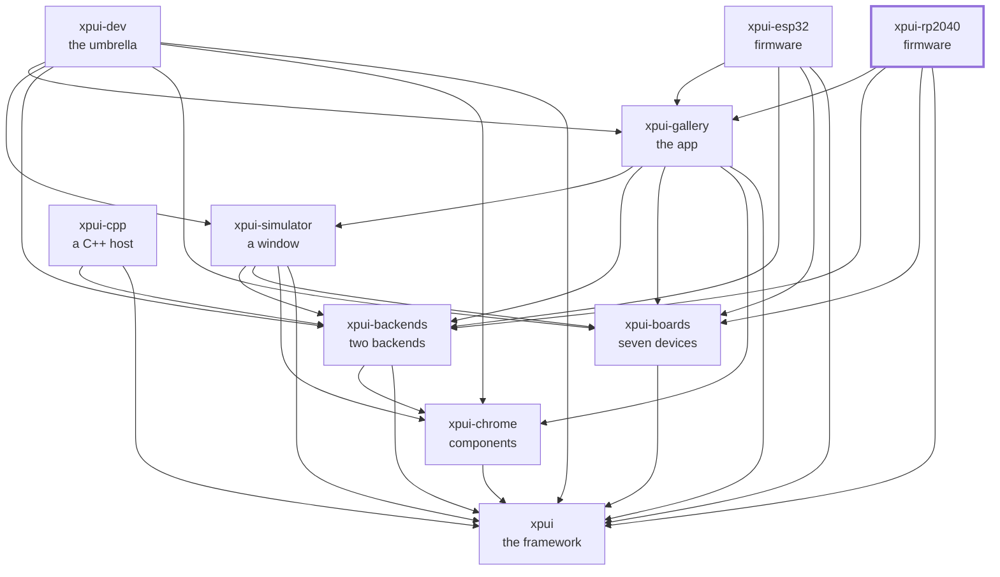

[](https://github.com/XPUI-Framework/xpui-rp2040/actions/workflows/ci.yml) [](LICENSE)

<picture>
  <source media="(prefers-color-scheme: dark)" srcset="assets/logo-black.png">
  
</picture>

# MCU: RP2040

> [!WARNING]
> Under heavy development. Not production-ready. The API can break without
> notice. Use at your own risk.

Two firmware binaries that flash [the gallery](https://github.com/XPUI-Framework/xpui-gallery/tree/main/gallery)
to a Pimoroni board: the same screens the simulator runs, the same crate, and
no device-specific code in them at all. What differs between the two is a
`Board`, a `Palette`, and which pin is wired to what; the frame loop, the
button handling and the heap are shared.

| Binary | Board | Panel | Driver |
|---|---|---|---|
| `badger2040` | [Badger 2040](https://shop.pimoroni.com/products/badger-2040) | 296x128 monochrome e-ink | UC8151 over SPI |
| `tufty2040` | [Tufty 2040](https://shop.pimoroni.com/products/tufty-2040) | 320x240 colour IPS LCD | ST7789v over an 8-bit parallel bus |

Every document in this repository is listed in [docs/README.md](docs/README.md).

## Using it

For a firmware, using it is building it and flashing it. Both binaries:

```bash
cargo build --release --bin badger2040
cargo build --release --bin tufty2040
```

No `--target`: `.cargo/config.toml` sets `thumbv6m-none-eabi` for every
`cargo build` and `cargo run` at this repository's root or below. Naming it as
well changes nothing. `cargo install` ignores that setting, so the tools below
still build for your laptop.

The ELF lands in `target/thumbv6m-none-eabi/release/`. This crate
is its own workspace, so it has a `target/` of its own — see
[its own workspace](docs/contributing.md#its-own-workspace).

**Flash over USB, no probe.** Install the tool first — it is a compile, and
the board should not be sitting in bootloader mode while it runs:

```bash
cargo install elf2uf2-rs
```

Then hold BOOTSEL, plug the board in, wait for the `RPI-RP2` drive, and **from
the repository root**:

```bash
elf2uf2-rs -d target/thumbv6m-none-eabi/release/badger2040
```

`-d` converts and copies in one step; the board reboots into the firmware by
itself. Without `-d` you get a `.uf2` beside the ELF to drag across yourself.

**Flash with a probe.** From the repository root:

```bash
cargo install probe-rs-tools
cargo run --release --bin badger2040
```

`.cargo/config.toml` points the runner at
`probe-rs run --chip RP2040 --protocol swd`. This
crate's release profile keeps the symbol table — see the note on it in
`Cargo.toml` — so a probe session shows names, and the RTT log arrives without
any extra flag.

### The one warning you will see

```text
warning: the following packages contain code that will be rejected by a future
version of Rust: proc-macro-error2 v2.0.1
```

Not ours, and not fixable here. It arrives four levels down —
`embassy-rp` → `pio` → `pio-proc` → `proc-macro-error2` — where that crate
re-exports `proc_macro` in a way
[rust-lang/rust#127909](https://github.com/rust-lang/rust/issues/127909) is
phasing out. 2.0.1 is the newest published version and still has it, so there is
nothing to upgrade into.

It is a cargo future-incompatibility report about a dependency's own source,
not a warning about this workspace, and it fails no gate. It is also a
**build-time** proc-macro running on your laptop: nothing it affects is
compiled into what the board runs. It goes away when `proc-macro-error2`
publishes a fix or `embassy-rp` moves off `pio-proc`; the only way to force it
sooner is a `[patch]` onto a fork of somebody else's crate, which is a worse
thing to own than a warning.

## Requirements

- One of the two boards. **No extra hardware to flash over USB** — both
  appear as a mass-storage device when you hold **BOOTSEL** while plugging them
  in.
- Optional, for `cargo run` and a debugger: a
  [Raspberry Pi Debug Probe](https://shop.pimoroni.com/products/raspberry-pi-debug-probe)
  or a second Pico running picoprobe, wired to the SWD pads.
- The target, which `rust-toolchain.toml` already lists:

  ```bash
  rustup target add thumbv6m-none-eabi   # only if it is somehow missing
  ```

## Checking it

```bash
./build-and-test.sh          # format, the board's lint, and the prose
./build-and-test.sh all      # the above, plus linking both firmware images
```

The checks are in [`xtask/`](xtask/) — this repository's own list, in Rust,
holding nothing it does not run — and one command reaches all three of this
repository's workspaces. How a change is reviewed is in
[docs/contributing.md](docs/contributing.md).

## Where it sits

Every arrow is a dependency in a `Cargo.toml`, and they all point inward
toward `xpui`, which depends on nothing at all. That is the rule the
organisation is arranged around: a backend can be written without the framework
knowing it exists, and a firmware reaches whatever it needs directly rather
than through whoever happens to sit above it.



## License

MIT — see [LICENSE](LICENSE). Copyright (c) 2026 Thiago Holanda.
